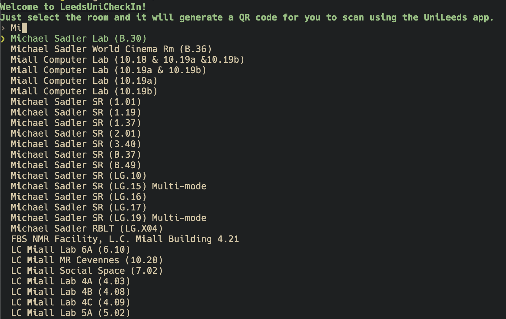

# Leeds Uni Check In



A simple CLI tool to generate QR Codes for checking into classes at the University of Leeds. Just type in the name of the class and enter it with the Fuzzy Finder powered autocomplete and it will generate a ```qrcode.png``` file in the same directory that you can scan with the University of Leeds app to check in.

Just download the zip folder for your operating system and run the program. Or you can open the program in the terminal by navigating to the folder and doing ./LeedsUniCheckIn
